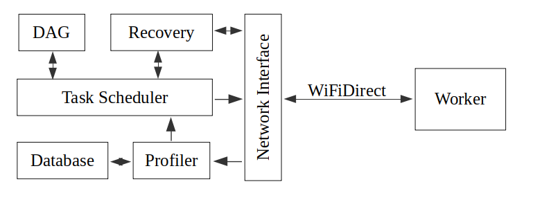

# Simple Resource Aware Task Scheduling System for Heterogeneous Mobile Devices

** work in progress **

A simple DAG scheduler that uses Criticality Aware Task Scheduling algorithm (CATS) to offload computational-heavy tasks to nearby mobile devices.

## Disclaimer
Do not use this system. This is a research project focusing on the performance of task offloading on mobile device. Security is not in the scope of this project. Potential risks of using this project includes leaking sensitive data of the offloaded task to untrusted device and offloadee being sent malicious executable code. Please refrain from using this project for safety.

## About
This is an experiment on the performance gain of offloading computational-heavy tasks to a great number of smart phones (around 50 phones).

The structure of the system is as follows,

#### DAG
It is where the tasks to be offloaded are stored and analysed for their criticality. Criticality is an indication of how many tasks are waiting for that task to be executed first, before the waiting tasks can. Thus task with higher criticality is assigned with higher performance workers (phones), so that the overall DAG can be executed faster. This is also the basic idea of the CATS algorithm
#### Profiler
It keeps track of the performance of each worker and stores them in the database.
#### Task Scheduler
Assigns tasks to workers using the data provided by profiler.
#### Recovery
Keeps track of the tasks assigned. If a error message is received from the workers or the time taken for a task exceeeded the acceptable duration, recovery ask the assigned worker to execute it again. If the second execution also fails, it will notify the system to drop that worker.
#### Worker
is the offloadee that executes the assigned tasks.
#### WiFiDirect
A peer-to-peer way to communicate with mobile devices. It is choosen for its suport for connecting to large number of devices. This eliminates the need of hops, and speeds up the communication between devices.

## Run application
To run the applicaiton, 
1. connect mobile devices to a computer. 
    - it is recommended to use smart phones instead of virtual devices.
2. click 'Run app' on Android Studio.

